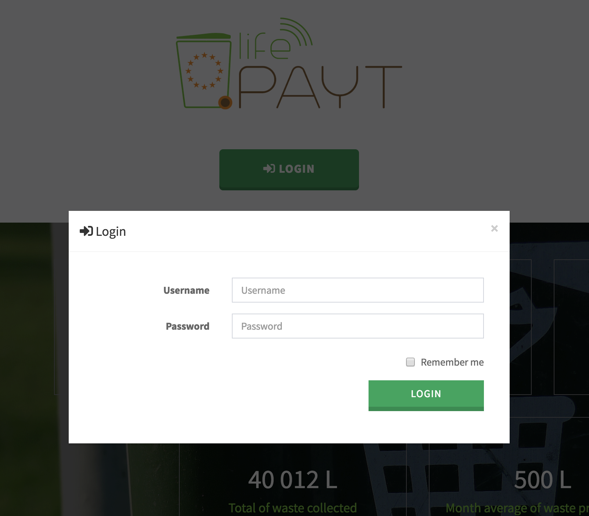

---

## Registration ##

The registration process is only available for the admin and counties directly at this application. The admin or associated county will create your account and you'll receive your credentials by email/letter.

## User Login ##

Users who are registered in Life-Payt system must login by:

* Entering their User Name.
* Entering their Password.
* Thick the checkbox if the user wants to keep the session open for the next 5 days.
* Selecting 'Sign In' to advance to the next screen and begin using the application. 

|  | 
|:--:| 
| Login Screen |

### First Login ###

On first login a new form will be presented so you can add additional info:

* E-mail
* New password

|  | 
|:--:| 
| Form to add additional info | 