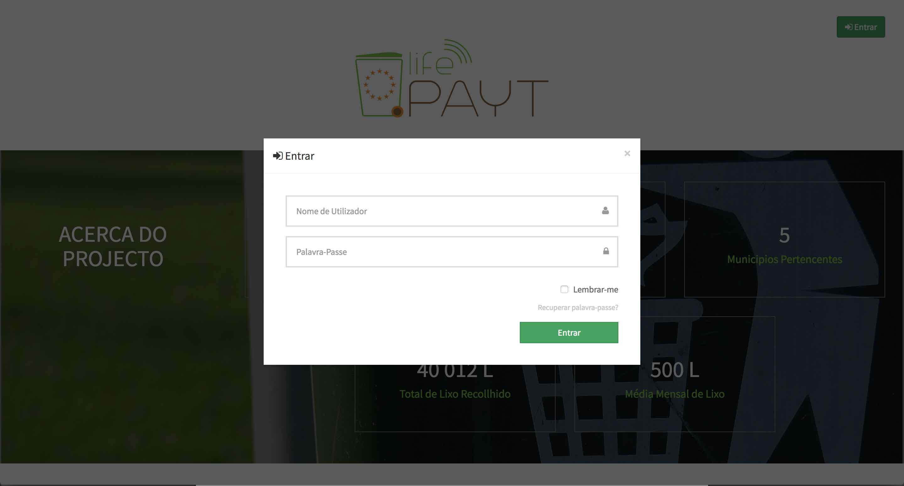

---

## Registo ##

O processo de registo apenas está disponível para o administrador e para os municípios diretamente a partir da aplicação. O administrador ou município associado irá criar a sua conta e posteriormente irá ter acesso às suas credenciais através de um email/carta.

## Iniciar Sessão ##

Os utilizadores que já estejam registados no sistema Life Payt podem iniciar sessão na sua conta da seguinte maneira:

* Inserindo o seu nome de utilizador.
* Inserindo a sua palavra-passe.
* Marcando a checkbox se pretender que a sessão continue aberta nos próximos 5 dias.
* Clicando en 'Entrar' para avancar para a sua dashboard e começar a utilizar a aplicação.

|  | 
|:--:| 
| Ecrã de Login |

### Primeiro Login ###

Caso seja a primeira vez que esteja a iniciar sessão irá ser apresentado um novo formulário para preencher com informações adicionais:

* E-mail 
* Nova palavra-passe

|  | 
|:--:| 
| Formulário para adicionar informação adicional | 