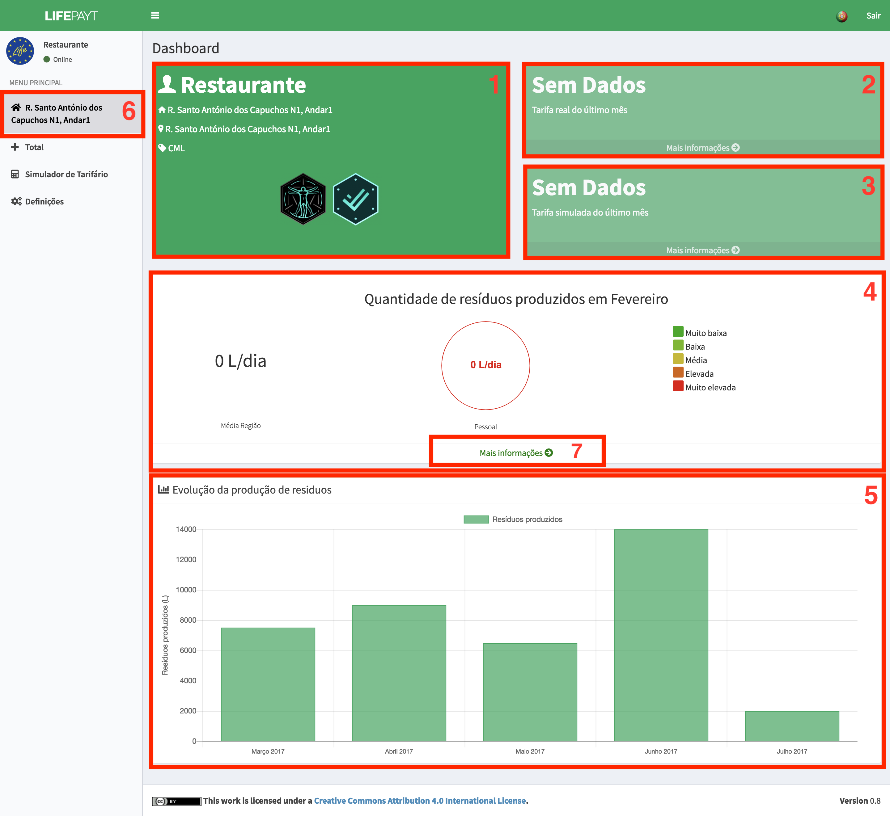
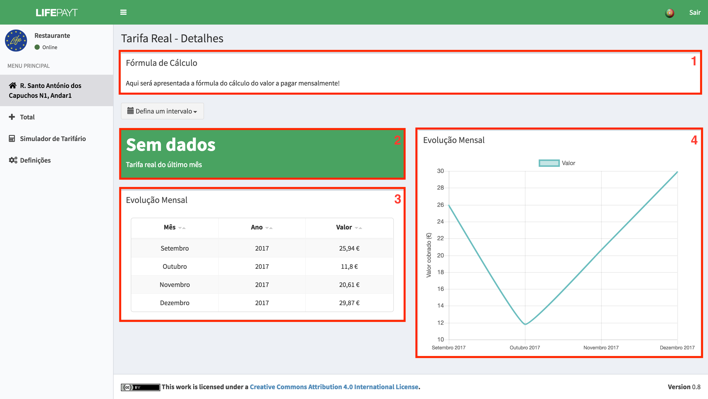
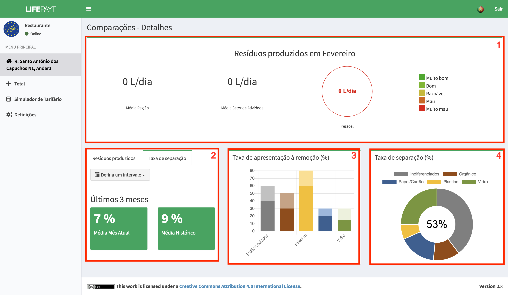

---

Depois de efetuado o login, o utilizador (grande produtor) será redirecionado para uma página onde têm acesso a várias informações acerca de cada morada **(6)** associada ao seu perfil.  

Em **(1)**, o utilizador pode observar alguma da sua informação pessoal, tal como o seu nome, morada, entidade responsável pela recolha de resíduos e algumas das suas conquistas (ainda não implementado).

Relativamente às faturas, o utilizador terá, de imediato, acesso aos valores da fatura real **(2)** e simulada **(3)** do último mês. Caso o utilizador clique no botão **Mais informação**, terá acesso a informação mais detalhada sobre as faturas, reais ou simuladas dependendo bo botão que selecionar. 

Para além de informação acerca dos valores das faturas, o utlizador tem a possibilidade de comparar a sua produção de resíduos do último mês com a média da sua região **(4)** e perceber como é que esse valor é qualificado em termos ambientais, se é bom ou mau.

Em **(5)** o utilizador tem acesso a um gráfico que apresenta os valores correspondentes à produção de resíduos ao longo dos últimos meses.

|  |
|:--:| 
| Fig.1 - Fatura real e simulada relativas a uma morada |

---

Quando o utilizador clica no botão **Mais informação** em **(2)** ou **(3)** será apresentada a informação presente na fig. 2 que corresponde:

1. à fórmula que é usada para calcular o valor da fatura; 
2. ao valor da fatura no último mês;
3. aos valores da fatura referentes a cada mês em forma de tabela;
4. aos valores da fatura referentes a cada mês em forma de gráfico;

|  |
|:--:| 
| Fig.2 - Informação detalhada sobre as faturas |

---

Tanto a tabela como o gráfico apresentam os meses referentes ao intervalo que pode ser selecionado pelo utilizador como é mostrado na fig. 3.

Fig.3 - Intervalos de tempo

Caso o utilizador clique no botão **Mais informação (7)** em **(4)**, terá acesso a informação detalhada sobre alguns indicadores pessoais e algumas comparações com produtores do mesmo setor de atividade e da mesma região **(1)** (fig.4). 

Em **(2)** o utilizador pode consultar média do mês atual com a média do histórico nos últimos 3/6/12 meses tanto para valores relativos a resíduos produzidos como para valores relativos à sua taxa de separação.

Em **(3)** está representada, sob a forma de gráfico de barras, a taxa de apresentação à remoção dos diferentes tipos de resíduos.

Em **(4)** está representada, sob a forma de gráfico circular, a taxa de serparação dos diferentes tipos de resíduos.

|  |
|:--:| 
| Fig.4 - Informação detalhada sobre indicadores |