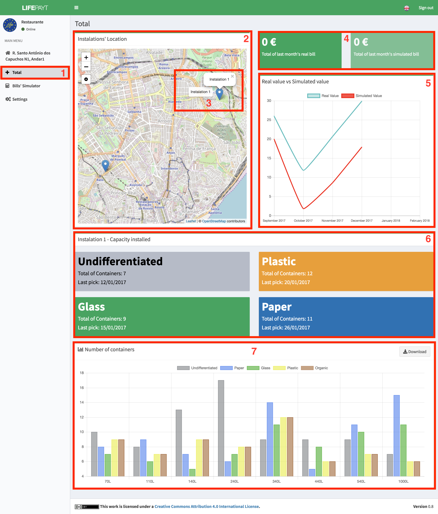

---

Clicking in tab **(1)** the user has access to a screen where the total values of last month's real and simulated bills are presented **(4)**. These values are the sum of the values of all addresses associated with the user.

Furthermore, the user can see the chart that shows the relation between the real and simulated value over the last 6 months **(5)**. On the left, the user has at his disposal an interactive map where he can see where his installations are located **(2)**.

In case the user wants to see more info about one of his buildings, he can select the one he wants in the map. After clicking on the location intended **(3)**, two new components will be presented. One of them to tell the user how many containers of each waste type are present in that location as well as the date of the last collection **(6)**. 

The other component is a chart **(7)** which represents the number of containers assigned according to their capacity and type of waste. This chart is interactive and lets the user hide the types of waste he wants just by clicking on the respective label displayed at the top of the component. The data associated with the chart can be downloaded formatted as a JSON file by clicking on **Download** button which is in the upper right corner. 

Fig.1 - Total tab
