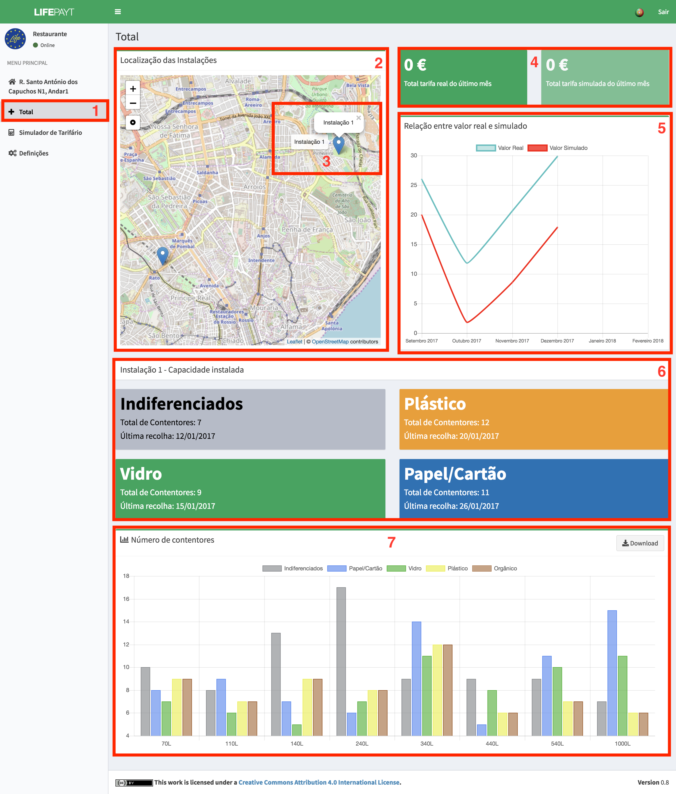

---

Clicando no separador **(1)** o utilizador tem acesso a um ecrã que apresenta o valor total das tarifas reais e simuladas do último mês, de todas as moradas associadas a si **(4)**. Para além disso poderá consultar o gráfico que mostra a relação entre o valor real e o simulado ao longo dos últimos 6 meses **(5)**.  

Por fim, do lado esquerdo, tem à disposição um mapa interativo onde se encontram as moradas das suas instalações **(2)**.

Caso pretenda obter mais informações sobre uma das suas instalações, o utilizador pode selecionar no mapa a instalação pretendida. Após clicar na instalação **(3)**, irão ser apresentados dois novos componentes. Um deles serve para informar o utilizador do número total de contentores de cada tipo de resíduos que estão presentes nessa instalação, bem como a data da última recolha **(6)**.  

O outro componente é um gráfico **(7)** que representa o número de contentores atribuídos de acordo com a sua capacidade e com o tipo de resíduos. Este gráfico é interativo e permite esconder os tipos de resíduos bastando para isso que clique em cima da respetiva lengenda presente no topo do componente. Os dados associados ao gráfico podem ser descarregados em formato JSON clicando no botão **Download** que se encontra no canto superior direito.

Fig.1 - Ecrã relativo ao separador Total
