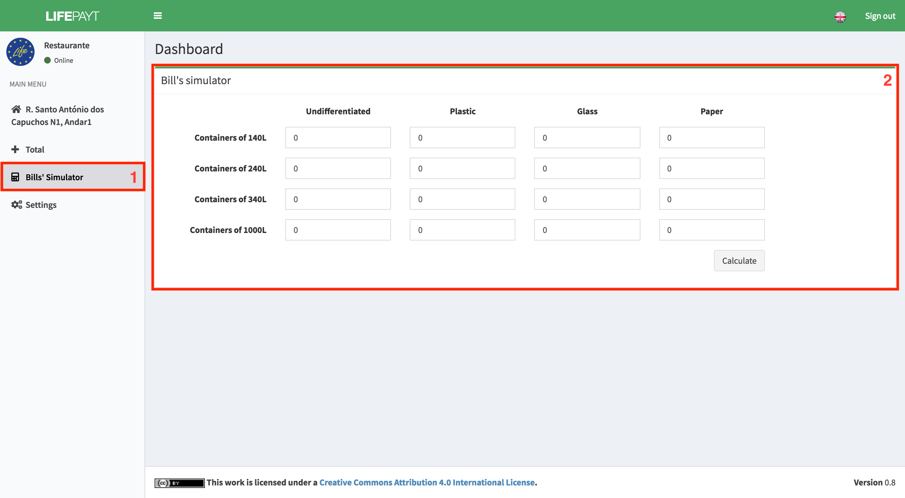

---

In this tab **(1)** the user can find a simulator where he has the possibility to simulate multiple scenarios and obtaining the value he would pay if that scenario was applied. Thanks to this simulator the user can adjust the number of containers of each capacity and waste type so he could pay less without affecting his business.  

After filling in the form the user just has to click in **Calculate** and the value will be presented below the simulator.

Fig.1 - Screen with bills' simulator
