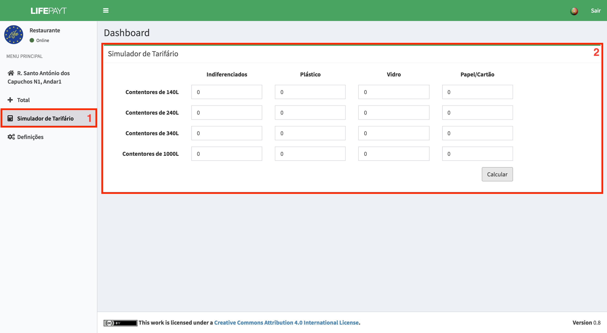

---

Neste separador **(1)** está presente um simulador de tarifas onde o utilizador tem a possibilidade de simular vários cenários e obter o valor que iria pagar nesse cenário. Graças a este simulador o utilizador pode ajustar o número de contentores de cada capacidade e tipo de resíduos de forma a pagar menos sem que isto afete o seu negócio.  

Após preencher o formulário basta clicar no botão **Calcular** e o valor simulado irá aparecer por baixo do simulador.

Fig.1 - Ecrã relativo ao simulador de tarifas
