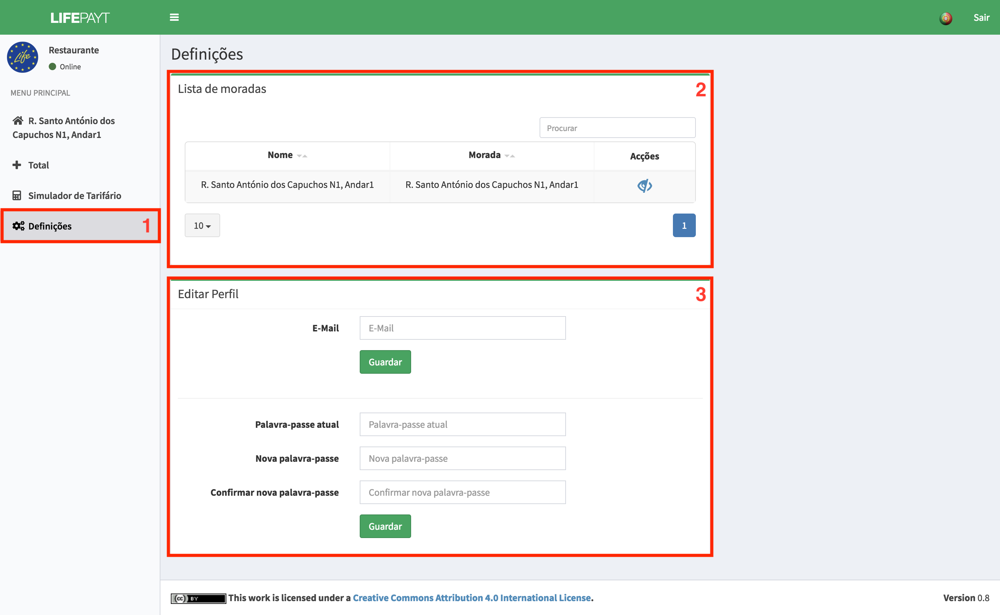

---

Neste separador **(1)** o utilizador tem acesso a uma zona onde são listadas, sob a forma de tabela, todas as moradas que tem associadas a si **(2)**. Nesta tabela o utilizador pode realizar duas ações, uma delas é a possibilidade de alterar o nome da morada, i.e. dar um nome mais amigável a uma certa morada, sendo depois este o nome que irá aparecer na barra lateral do lado esquerdo.  

Para além disso o utilizador pode "esconder" uma morada (ainda em desenvolvimento), i.e. fazer com que uma certa morada não apareça na barra lateral nem seja utilizada nos cálculos dos totais das faturas e quantidade de resíduos produzidos. Ao esconder uma morada, não faz com que ela deixe de estar associada a si nem que a quantidade de resíduos nela produzidos não seja contabilizada, apenas terá impacto na interface visual.  

Fig.1 - Ecrã relativo ao painel de definições

---

Para além da informação sobre as moradas é neste espaço que o utilizador pode alterar a sua palavra-passe utilizando para isso o formulário **(3)**. 

Para alterar o seu e-mail basta preencher a parte superior do formulário com o novo endereço de e-mail e clicar no botão **Guardar**.

Para alterar a sua palavra-passe o utilzador terá de:

* Inserir a sua palavra-passe atual;
* Inserir a palavra-passe para a qual pretende alterar;
* Inserir outra vez a nova palavra-passe para confirmar;
* Clicar no botão **Confirmar**. 

Após confirmar, o pedido de alteração será enviado podendo ter 4 resultados possíveis que serão mostrados sob a forma de notificação no canto inferior direito durante um período de 5s (fig. 2).

Fig.2 - Notificações no processo de alteração de palavra-passe
