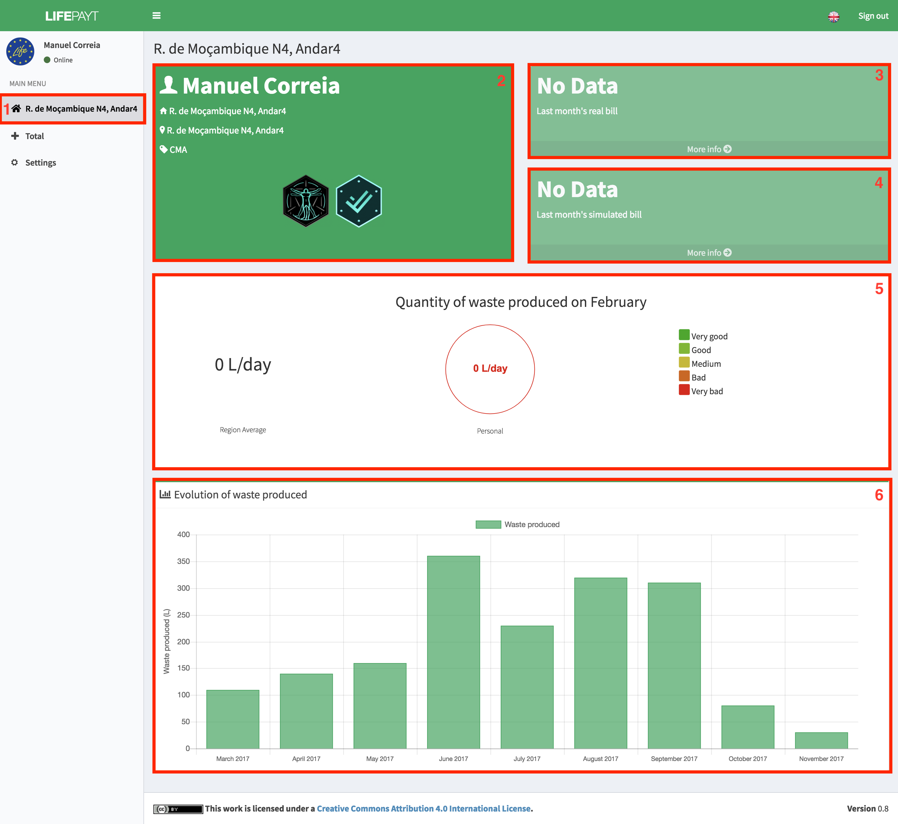
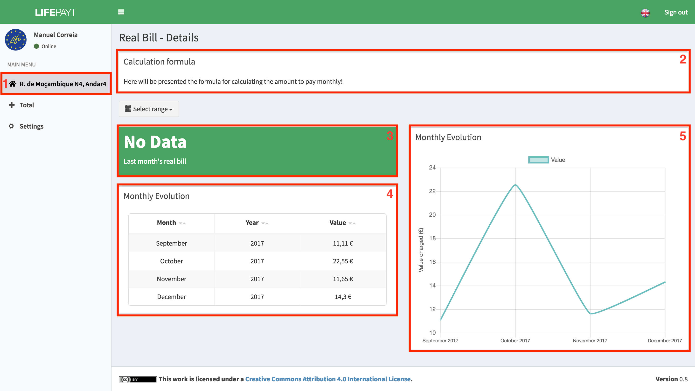
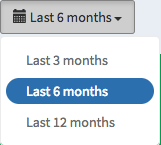

---

Once logged in, the user (small producer) will be redirected to a page where he has access to some info about each address **(1)** associated.  

In **(2)**, the user can visualize some of his personal info like his name, address, entity responsible of the waste collection and his badges (not implemented yet). 

Regarding the bills, the user will immediately have access to the real **(3)** and simulated **(4)** bill's value of the last month. If the user clicks on **More info** button, he will have access to the more detailed information about the bills, real or simulated depending on the button he selects.

In addition to information about bills' values, the user has the possibility to compare his waste production from the last month with the average of his region **(5)** and to see how this value is qualified in environmental terms, whether it is good or bad.

In **(6)** the user has access to a chart that shows the values corresponding to the production of waste over the last months.

|  |
|:--:| 
| Fig.1 - Real and simulated bill of a single address |

---

When the user clicks on **More info** in **(3)** or **(4)** button, some additional info will be presented (fig. 2):

2. formula used to calculate the bills' value; 
3. last month bill's value;
4. the bill's values for each month in the form of a table;
5. the bill's values for each month in the form of a chart;

|  |
|:--:| 
| Fig.2 - Detailed info about bills |

---

Both the table and the chart show the months referring to the interval which can be selected by the user as shown in Fig. 3.

Fig.3 - Time intervals
