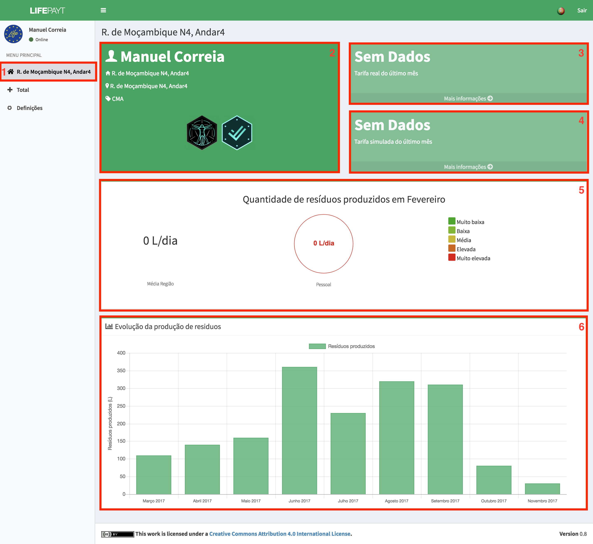

---

Depois de efetuado o login, o utilizador (pequeno produtor) será redirecionado para uma página onde têm acesso a várias informações acerca de cada morada **(1)** associada ao seu perfil.  

Em **(2)**, o utilizador pode observar alguma da sua informação pessoal, tal como o seu nome, morada, entidade responsável pela recolha de resíduos e algumas das suas conquistas (ainda não implementado).

Relativamente às faturas, o utilizador terá, de imediato, acesso aos valores da fatura real **(3)** e simulada **(4)** do último mês. Caso o utilizador clique no botão **Mais informação**, terá acesso a informação mais detalhada sobre as faturas, reais ou simuladas dependendo bo botão que selecionar. 

Para além de informação acerca dos valores das faturas, o utlizador tem a possibilidade de comparar a sua produção de resíduos do último mês com a média da sua região **(5)** e perceber como é que esse valor é qualificado em termos ambientais, se é bom ou mau.

Em **(6)** o utilizador tem acesso a um gráfico que apresenta os valores correspondentes à produção de resíduos ao longo dos últimos meses.

|  |
|:--:| 
| Fig.1 - Fatura real e simulada relativas a uma morada |

---

Quando o utilizador clica no botão **Mais informação** em **(3)** ou **(4)** será apresentada a informação presente na fig. 2 que corresponde:

2. à fórmula que é usada para calcular o valor da fatura; 
3. ao valor da fatura no último mês;
4. aos valores da fatura referentes a cada mês em forma de tabela;
5. aos valores da fatura referentes a cada mês em forma de gráfico;

|  |
|:--:| 
| Fig.2 - Informação detalhada sobre as faturas |

---

Tanto a tabela como o gráfico apresentam os meses referentes ao intervalo que pode ser selecionado pelo utilizador como é mostrado na fig. 3.

Fig.3 - Intervalos de tempo
