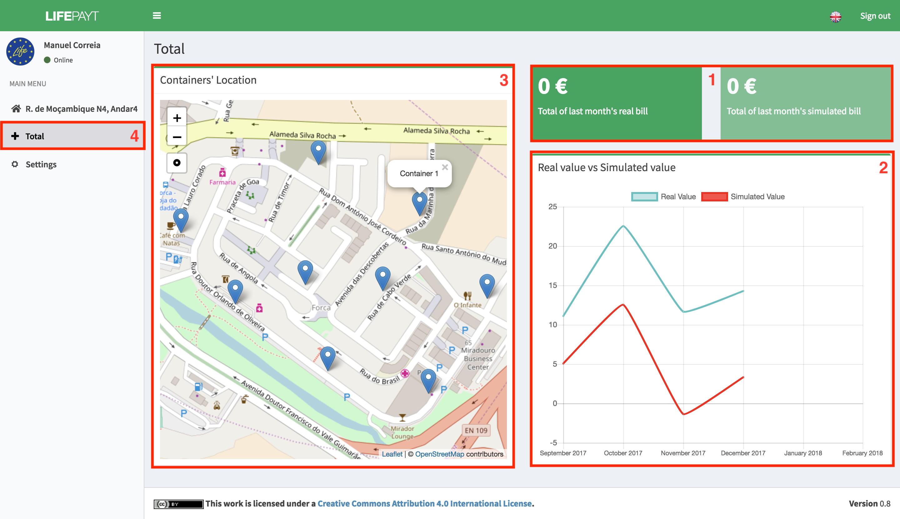

---

Clicking in tab **(4)** the user has access to a screen where the total values of last month's real and simulated bills are presented **(1)**. These values are the sum of the values of all addresses associated with the user.

Furthermore, the user can see the chart that shows the relation between the real and simulated value over the last 6 months **(2)**. On the left, the user has at his disposal an interactive map where he can see where each container of his county is located **(3)**.

Fig.1 - Total tab
