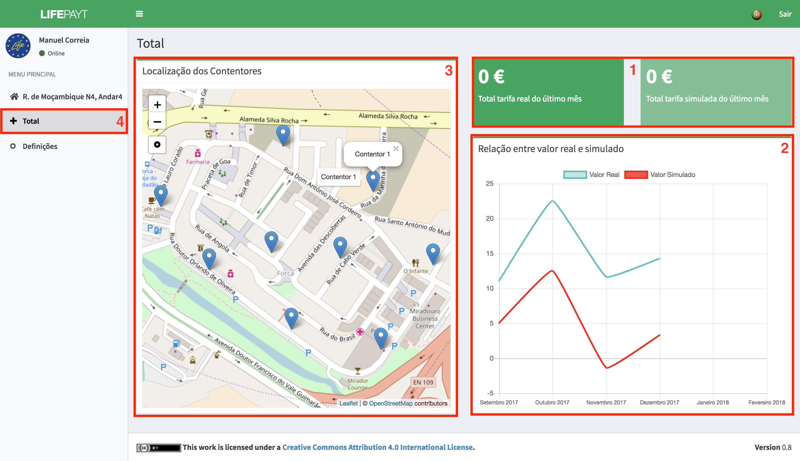

---

Clicando no separador **(4)** o utilizador tem acesso a um ecrã que apresenta o valor total das tarifas reais e simuladas do último mês, de todas as moradas associadas a si **(1)**. Para além disso poderá consultar o gráfico que mostra a relação entre o valor real e o simulado ao longo dos últimos 6 meses **(2)**.  

Por fim, do lado esquerdo, tem à disposição um mapa interativo onde se encontram as localizações de todos os contentores do seu município **(3)**.

Fig.1 - Ecrã relativo ao separador Total
