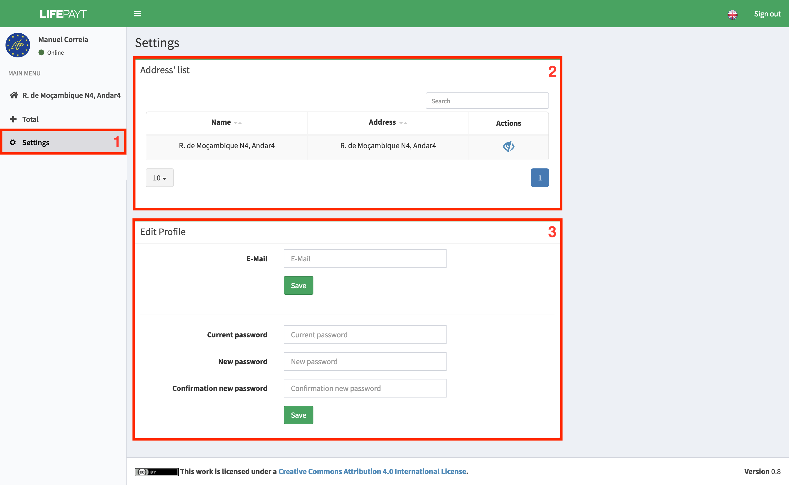

---

In this tab **(1)** the user has access to a zone where every address that are associated wiht him are presented in a table **(2)**. In this table the user can perform two actions. One of them is the possibility of changing the address' name, i.e. give a more friendly name, an alias, to an address. This new name will be used in the sidebar on the left.

Furthermore, the user can "hide" an address (still in development), i.e. make sure that a certain address does not appear in the sidebar nor is it used in calculations of bills totals and amount of waste produced. By hiding an address, it does not stop it from being associated with the user or that the amount of waste produced in it is not counted, it will only impact the visual interface.

Fig.1 - Settings panel

---

More than the info about the addresses, it's in this tab where the user can change his password by using the form **(3)**. 

To change the e-mail, he just has to fill in the first input box with the e-mail desired and click in **Save**.

To change the password, he has to:

* Fill in the current password;
* Fill in the new password;
* Fill in the new password again to confirm;
* Click in the button **Save**.

After click in the button, the change request is sent and the result will be display in the form of a notification during about 5 seconds and can be one of the following (fig. 2).

Fig.2 - Notifications in the process of changing the password
