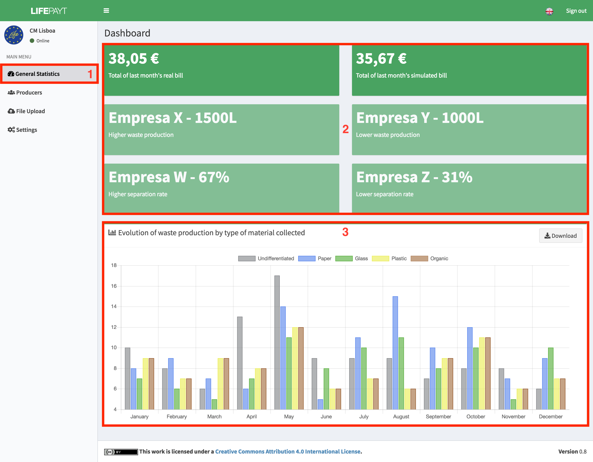
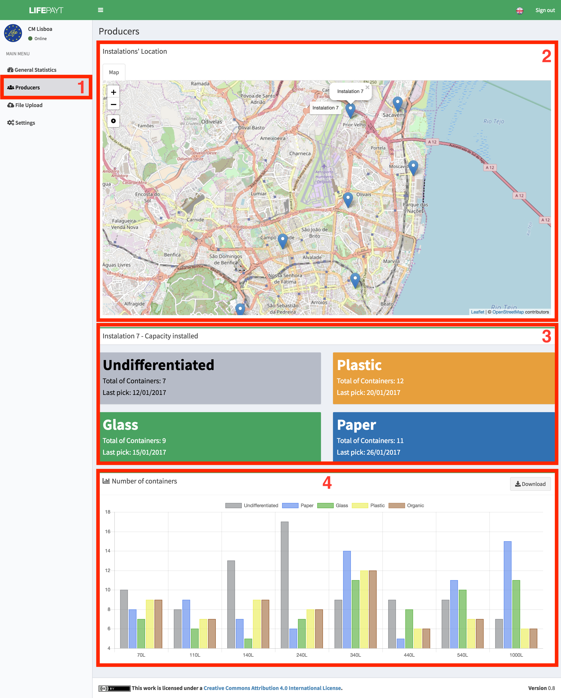
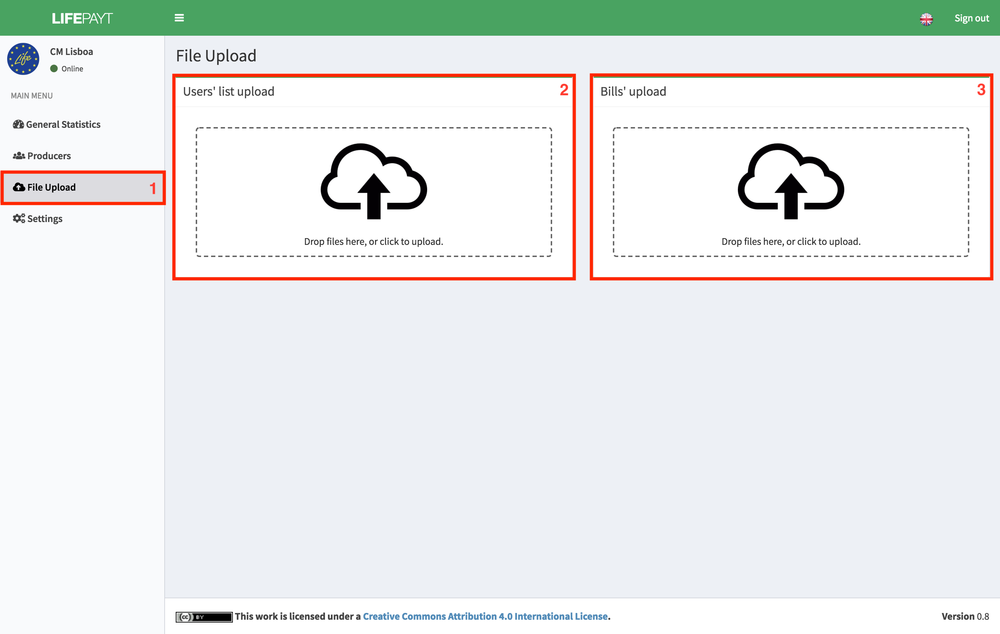
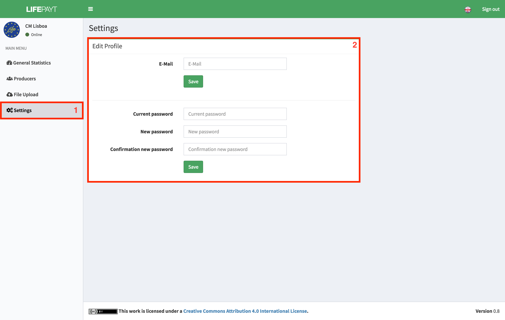

---

### 
 General Stats 

In the tab **(1)**, the user responsible for managing the municipality has access to a set of indicators for his municipality **(2)**, such as total values of real and simulated bills of the last month, customers with higher/lower waste production and customers with higher/lower separation rate.

In addition to these indicators it is possible to visualize a bar chart chart representing the evolution of waste production by type of material collected in the municipality over the last 12 months **(3)**.

|  |
|:--:| 
| Fig.1 - General stats related to the municipality |

---

### 
 Producers 

In this tab **(1)** there is a map showing the locations of all producers in the municipality **(2)**. If you want more information about one of the producers, you can select the desired producer on the map. After clicking on the producer, two new components will be presented. One shows the total number of containers of each type of waste present in that producer and the date of the last collection **(3)**.

The other component is a chart **(4)** which represents the number of containers assigned according to their capacity and type of waste. This chart is interactive and allows you to hide the types of residues by simply clicking on the respective tab at the top of the component. The data associated with the chart can be downloaded in JSON format by clicking the **Download** button in the upper right corner.

|  |
|:--:| 
| Fig.3 - Info about the producers of the municipality |

---

### 
 File Upload 

This **(1)** is the space where you can upload files to the platform. There are two distinct components responsible for loading the files, **(2)** which is reserved for uploading a file in CSV format with the current list of clients and **(3)** reserved for uploading files in the format XLS with a list of amounts charged in the previous month to each customer.

These files will be processed by the platform and will update the databases and the data that can be visualized in the user interfaces.

|  |
|:--:| 
| Fig.4 - File upload tab |

---

### 
 Settings 

It's in this tab **(1)** where the user can change his password and his e-mail by using the form **(2)**. 

To change the e-mail, he just has to fill in the first input box with the e-mail desired and click in **Save**.

To change the password, he has to:

* Fill in the current password;
* Fill in the new password;
* Fill in the new password again to confirm;
* Click in the button **Save**. 

|  |
|:--:| 
| Fig.5 - Settings panel |