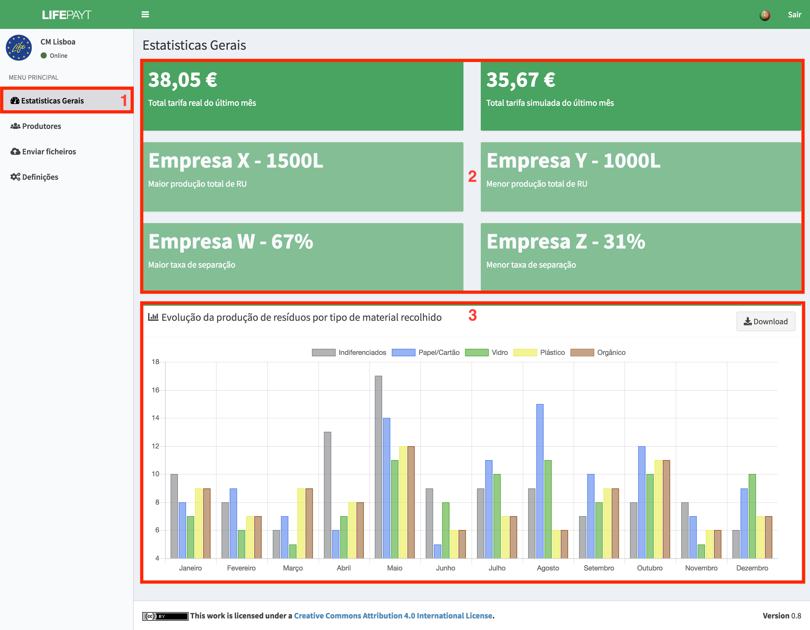
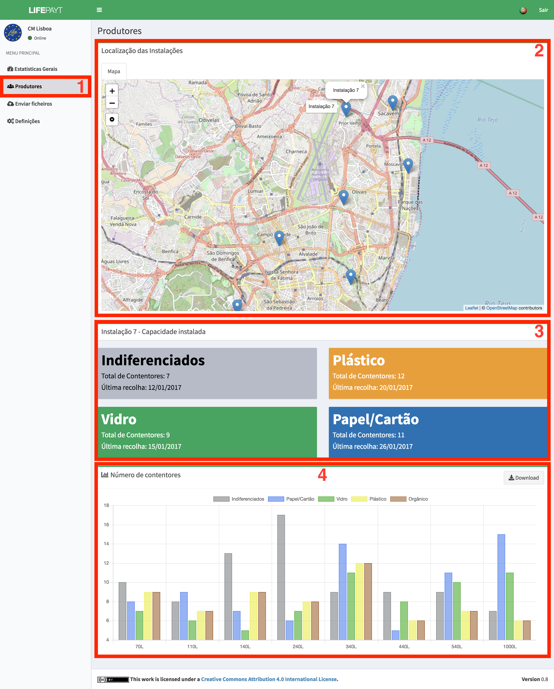
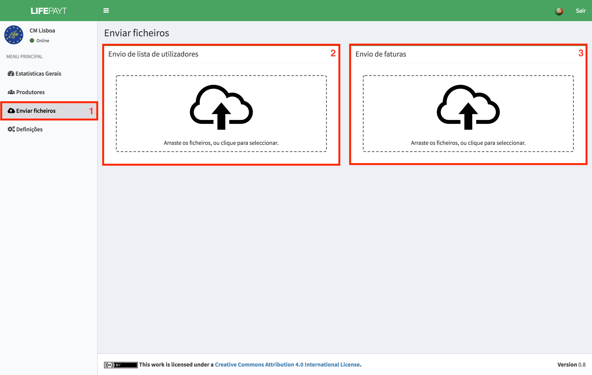
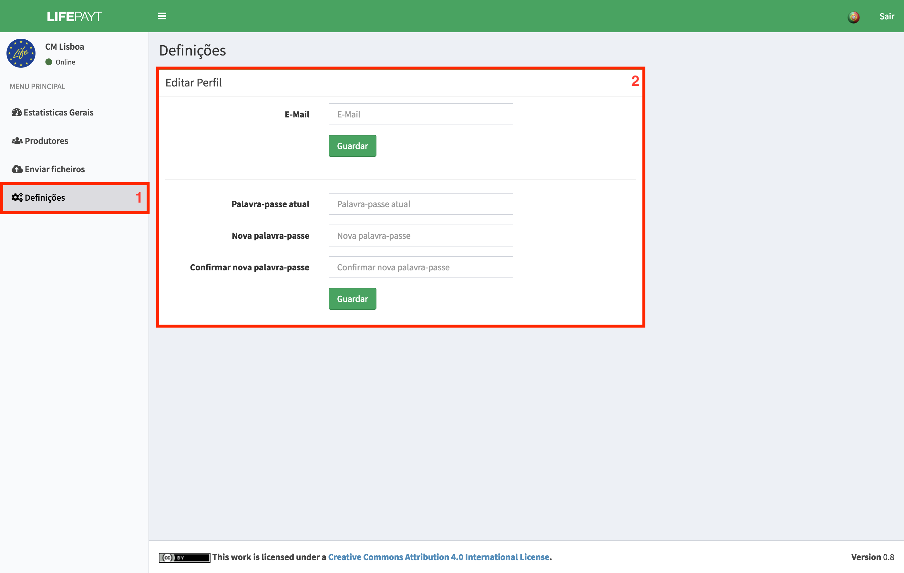

---

### 
 Estatísticas Gerais 

No separador **(1)** o utlizador responsável pela gestão do munícipio tem acesso a um conjunto de indicadores relativos ao seu município **(2)**, tais como valores totais das tarifas reais e simuladas do último mês, clientes com maior/menor produção de resíduos e clientes com maior/menor taxa de separação.

Para além destes indicadores é possível visualizar um gráfico de barras que representa a evolução da produção de resíduos por tipo de material recolhido no munícipio ao longo dos últimos 12 meses **(3)**.

|  |
|:--:| 
| Fig.1 - Estatísticas gerais sobre o munícipio |

---

### 
 Produtores 

Neste separador **(1)** encontra-se um mapa com as localizações de todos os produtores do munícipio **(2)**. Caso pretenda obter mais informações sobre um dos produtores, o utilizador pode selecionar no mapa o produtor pretendido. Após clicar no produtor, irão ser apresentados dois novos componentes. Um deles informa o número total de contentores de cada tipo de resíduos que estão presentes nesse produtor, bem como a data da última recolha **(3)**.

O outro componente é um gráfico **(4)** que representa o número de contentores atribuídos de acordo com a sua capacidade e com o tipo de resíduos. Este gráfico é interativo e permite esconder os tipos de resíduos bastando para isso que clique em cima da respetiva lengenda presente no topo do componente. Os dados associados ao gráfico podem ser descarregados em formato JSON clicando no botão **Download** que se encontra no canto superior direito.

|  |
|:--:| 
| Fig.3 - Informação sobre os produtores do munícipio |

---

### 
 Envio de ficheiros 

Este **(1)** é o espaço onde é possível carregar ficheiros para a plataforma. Existem dois componentes distintos para carregar os ficheiros, o **(2)** que está reservado ao envio de um ficheiro no formato CSV com a lista atual dos clientes e o **(3)** reservado ao envio de ficheiros no formato XLS com uma lista dos valores cobrados no mês anterior a cada cliente. 

Estes ficheiros serão processados pela plataforma e irão servir para atulizar as bases de dados refletindo-se na atualização dos dados que podem ser visualizados nas interfaces dos utilizadores.

|  |
|:--:| 
| Fig.4 - Espaço para carregar ficheiros |

---

### 
 Definições 

É neste espaço **(1)** que o utilizador pode alterar a sua palavra-passe e o seu e-mail utilizando para isso o formulário **(2)**. 

Para alterar o seu e-mail basta preencher a parte superior do formulário com o novo endereço de e-mail e clicar no botão **Guardar**.

Para alterar a sua palavra-passe o utilzador terá de:

* Inserir a sua palavra-passe atual;
* Inserir a palavra-passe para a qual pretende alterar;
* Inserir outra vez a nova palavra-passe para confirmar;
* Clicar no botão **Guardar**. 

|  |
|:--:| 
| Fig.5 - Ecrã relativo ao painel de definições |