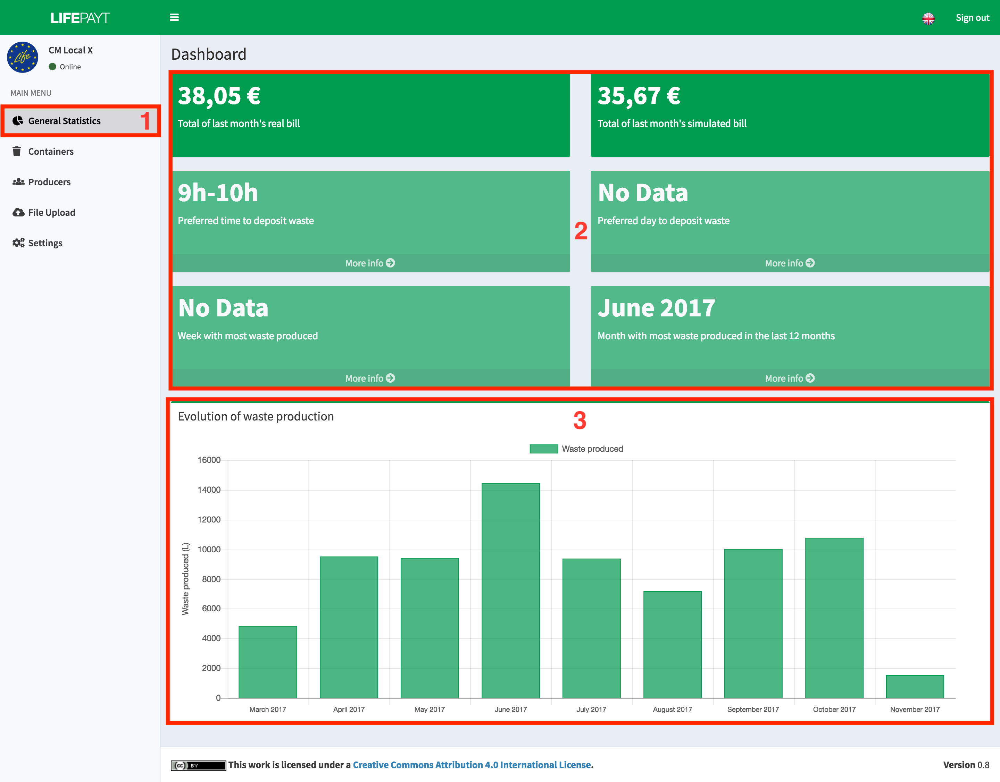
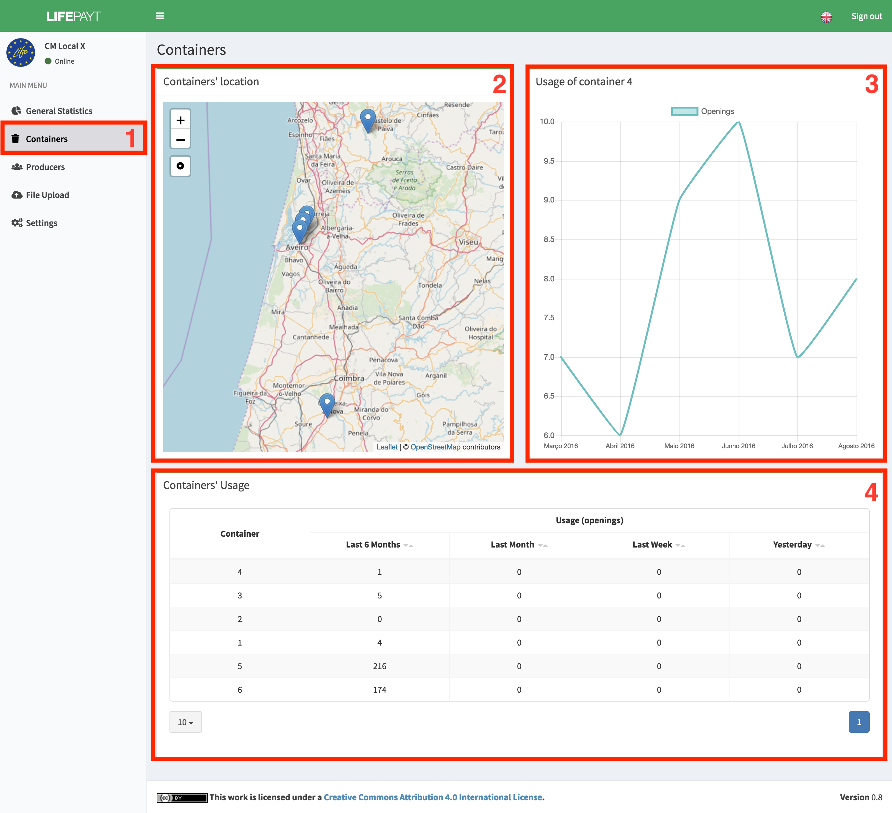
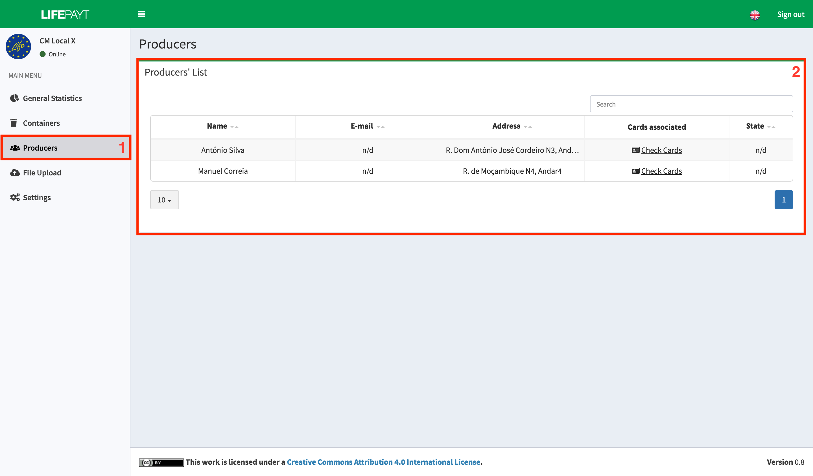
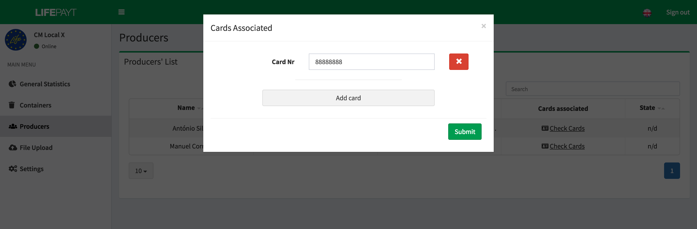
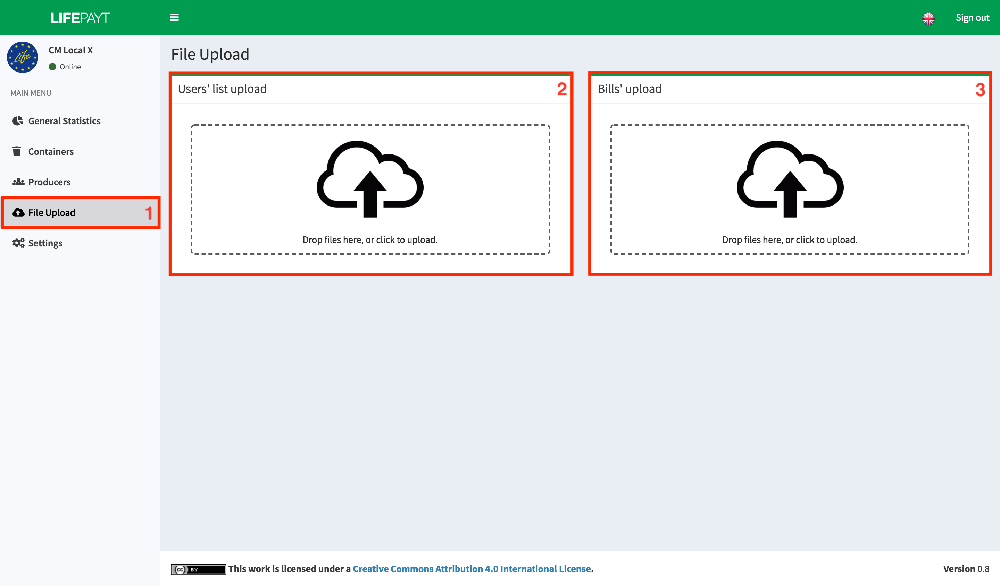
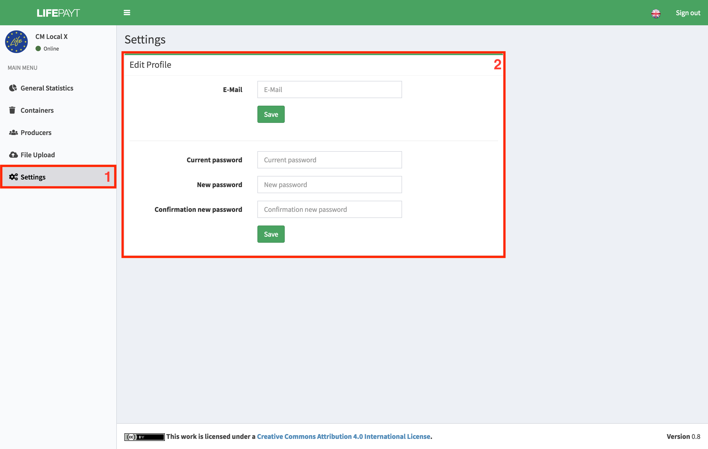

---

### 
 General Stats 

In the tab **(1)**, the user responsible for managing the municipality has access to a set of indicators about his municipality **(2)**, such as total values of real and simulated bills of the last month, 3 indicators (preferred time, day and week to deposit the waste) and, lastly, the month with the highest waste production.

In addition to these indicators it is possible to visualize a bar chart representing the evolution of municipal waste production over the last 12 months **(3)**.

|  |
|:--:| 
| Fig.1 - General stats related to the municipality |

---

### 
 Containers (still in development) 

This tab **(1)** contains detailed information regarding containers installed in the municipality. On the left **(2)** there is a map showing the locations of all containers. Clicking on one of these locations displays information about the usage of that container in the form of a chart **(3)**.

Below, there is information about the usage of each of the containers in the form of table **(4)**. It is possible for each container to visualize its usage in different periods of time.

|  |
|:--:| 
| Fig.2 - General stats related to the containers |

---

### 
 Producers 

In this tab **(1)** there is a table with information about all the producers of the municipality. In addition to the name, email and address you can also check the status of this producer on the platform (active / deactivated / banned) and RFID cards that he has associated with him. To access the card information you need to click **Check Cards**. 

|  |
|:--:| 
| Fig.3 - Info about the producers of the municipality |

After clicking **Check cards**, the screen shown in fig. 4 will be presented. All card management associated with a producer can be made here. You can add more cards, change existing ones or even remove cards.

|  |
|:--:| 
| Fig.4 - Info concerning the cards associted to a producer |

---

### 
 File Upload 

This **(1)** is the space where you can upload files to the platform. There are two distinct components responsible for loading the files, **(2)** which is reserved for uploading a file in CSV format with the current list of clients and **(3)** reserved for uploading files in the format XLS with a list of amounts charged in the previous month to each customer.

These files will be processed by the platform and will update the databases and the data that can be visualized in the user interfaces.

|  |
|:--:| 
| Fig.5 - File upload tab |

---

### 
 Settings 

It's in this tab **(1)** where the user can change his password and his e-mail by using the form **(2)**. 

To change the e-mail, he just has to fill in the first input box with the e-mail desired and click in **Save**.

To change the password, he has to:

* Fill in the current password;
* Fill in the new password;
* Fill in the new password again to confirm;
* Click in the button **Save**. 

|  |
|:--:| 
| Fig.6 - Settings panel |