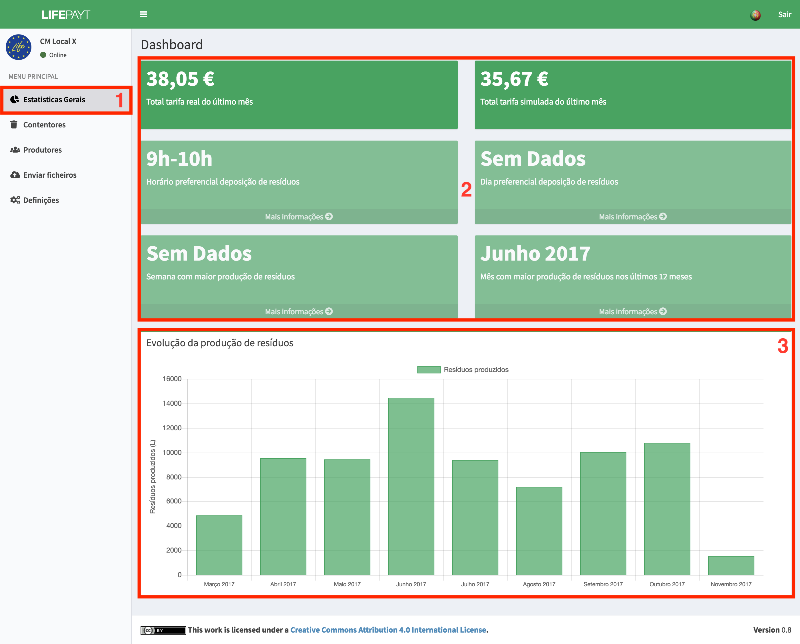
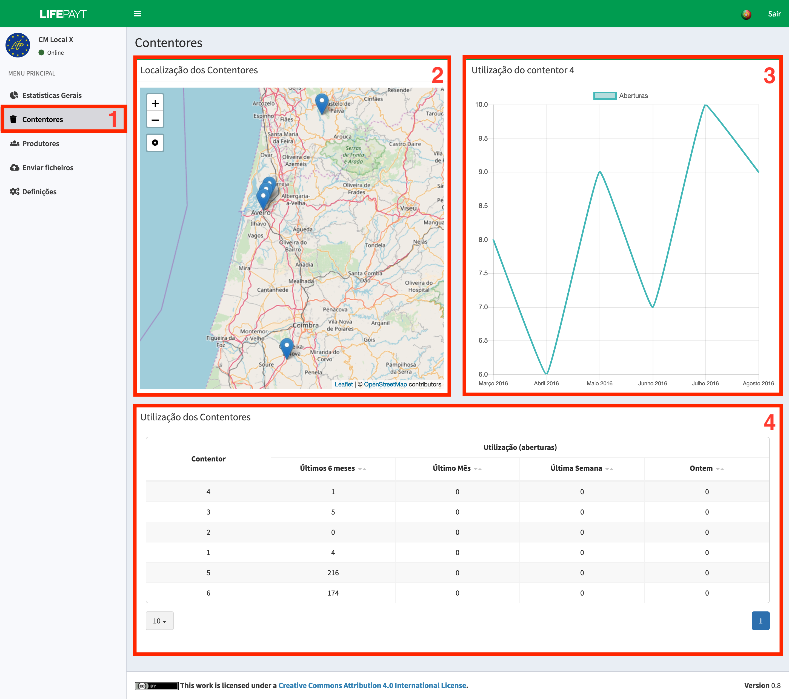
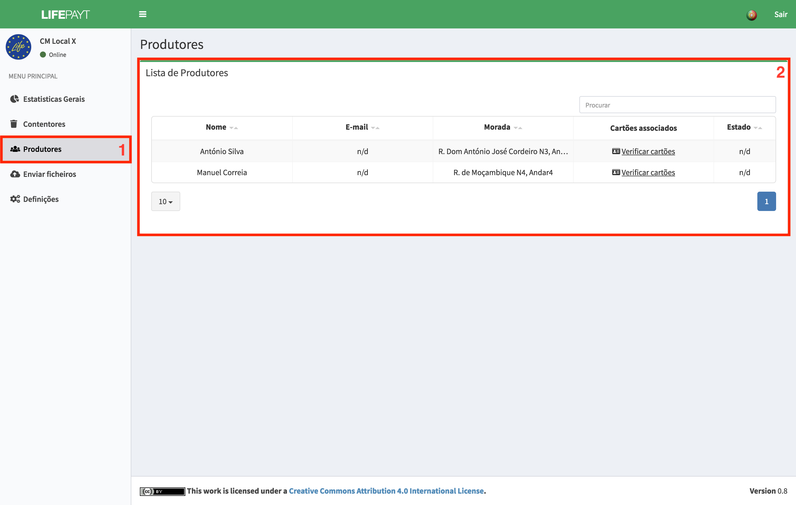
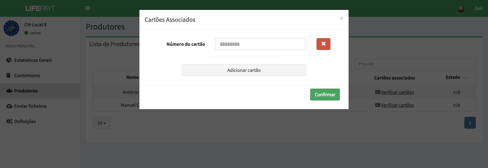
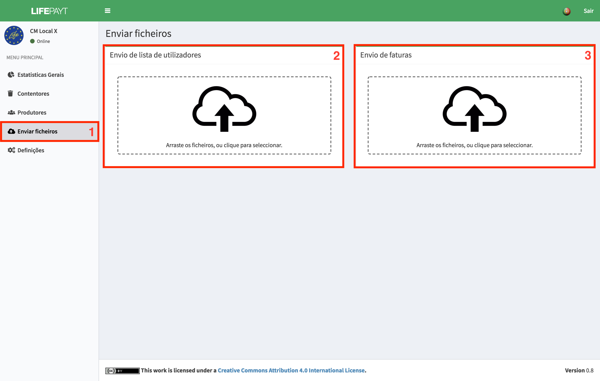
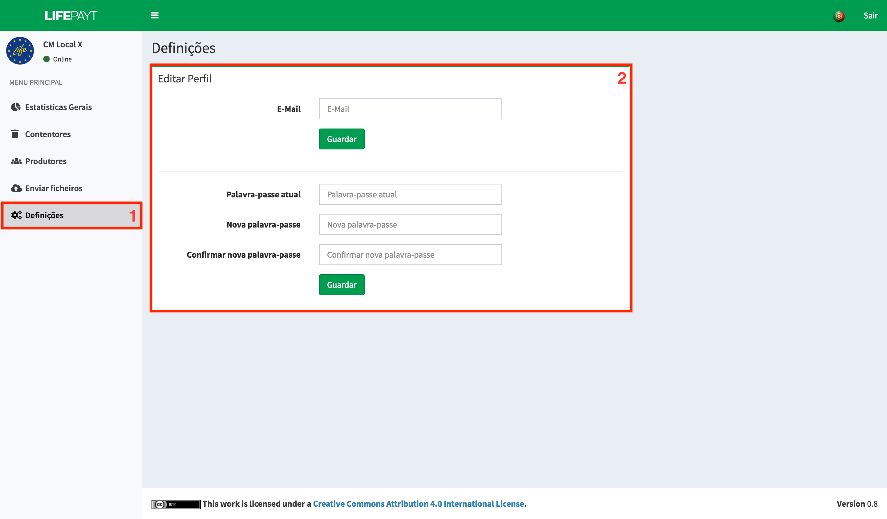

---

### 
 Estatísticas Gerais 

No separador **(1)** o utlizador responsável pela gestão do munícipio tem acesso a um conjunto de indicadores relativos ao seu município **(2)**, tais como valores totais das tarifas reais e simuladas do último mês, 3 indicadores das preferências dos clientes (horário, dia e semana preferencial para depositar os resíduos) e por último, o mês com maior produção de resíduos.

Para além destes indicadores é possível visualizar um gráfico de barras que representa a evolução da produção de resíduos no munícipio ao longo dos últimos 12 meses **(3)**.

|  |
|:--:| 
| Fig.1 - Estatísticas gerais sobre o munícipio |

---

### 
 Contentores (ainda em desenvolvimento) 

Este separador **(1)** contém informações detalhadas em relação aos contentores instalados no munícipio. À esquerda **(2)** encontra-se um mapa com as localizações de todos os contentores. Ao clicar numa dessas localizações é apresentada informação sobre a utilização desse mesmo contentor sob a forma de gráfico **(3)**.

Mais a baixo, é apresentada a informação acerca da utilização de cada um dos contentores sob a forma de tabela **(4)**. É possivel, para cada contentor, observar a sua utilização em diferentes períodos de tempo.

|  |
|:--:| 
| Fig.2 - Estatísticas sobre os contentores instalados |

---

### 
 Produtores 

Neste separador **(1)** encontra-se uma tabela com informação relativa a todos os produtores do munícipio. Para além do nome, e-mail e morada também possível verificar o estado desse produtor na plataforma (ativo/desativo/banido) e os cartões RFID que tem associados a si. Para ter acesso à informação relativa aos cartões é necessário clicar em **Verificar cartões**. 

|  |
|:--:| 
| Fig.3 - Informação sobre os produtores do munícipio |

Após clicar em **Verificar cartões** é apresentado o ecrã representado na fig. 4. Aqui pode ser feita toda a gestão dos cartões associados a um produtor. É possível adicionar mais cartões, alterar os já existentes ou mesmo remover cartões.

|  |
|:--:| 
| Fig.4 - Informação relativa aos cartões de um produtor |

---

### 
 Envio de ficheiros 

Este **(1)** é o espaço onde é possível carregar ficheiros para a plataforma. Existem dois componentes distintos para carregar os ficheiros, o **(2)** que está reservado ao envio de um ficheiro no formato CSV com a lista atual dos clientes e o **(3)** reservado ao envio de ficheiros no formato XLS com uma lista dos valores cobrados no mês anterior a cada cliente. 

Estes ficheiros serão processados pela plataforma e irão servir para atulizar as bases de dados refletindo-se na atualização dos dados que podem ser visualizados nas interfaces dos utilizadores.

|  |
|:--:| 
| Fig.5 - Espaço para carregar ficheiros |

---

### 
 Definições 

É neste espaço **(1)** que o utilizador pode alterar a sua palavra-passe e o seu e-mail utilizando para isso o formulário **(2)**. 

Para alterar o seu e-mail basta preencher a parte superior do formulário com o novo endereço de e-mail e clicar no botão **Guardar**.

Para alterar a sua palavra-passe o utilzador terá de:

* Inserir a sua palavra-passe atual;
* Inserir a palavra-passe para a qual pretende alterar;
* Inserir outra vez a nova palavra-passe para confirmar;
* Clicar no botão **Guardar**. 

|  |
|:--:| 
| Fig.6 - Ecrã relativo ao painel de definições |